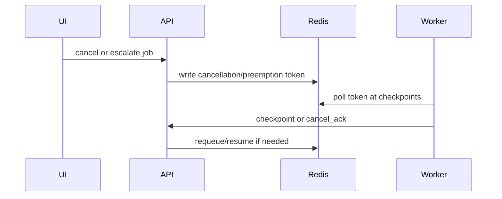

# Cancellation And Preemption Flows

## Purpose

Long inference, replay, and scrape jobs need cooperative cancellation and priority preemption without corrupting artifacts.

## Flow

## Rules

- Jobs check cancellation before work and at safe checkpoints.
- Replays can resume from artifact checkpoint.
- Urgent draft critique can preempt low-priority competitor batches.
- Preempted jobs retain `ResumeCheckpoint`.
