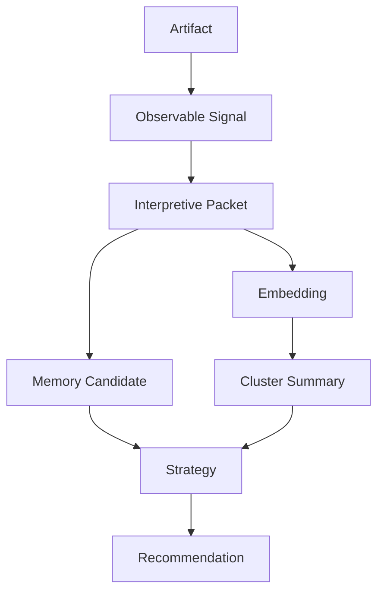

# Analysis Provenance Graphs

## Purpose

Every recommendation should trace back to artifacts, packets, embeddings, experiments, memories, routing decisions, and model outputs.

## Graph Shape

## Node Types

- `ObservationNode`: artifact or objective signal.
- `InferenceNode`: model output, semantic packet, cluster, strategy.
- `EvidenceLink`: directed relationship with confidence and source refs.

The graph is append-only. Corrections add new nodes and links rather than rewriting history.
