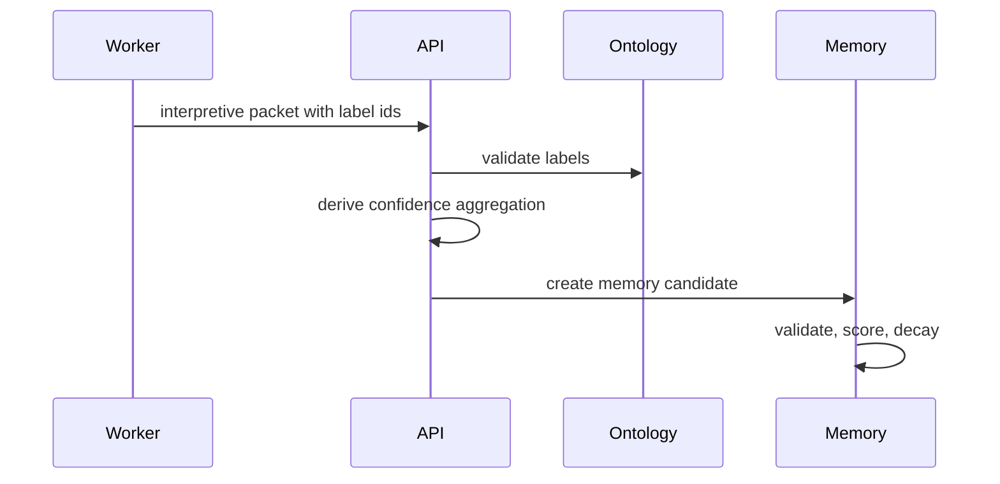
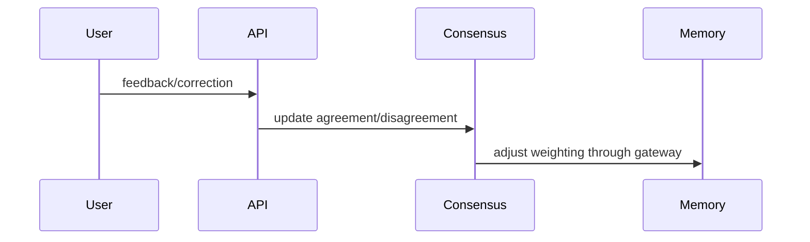
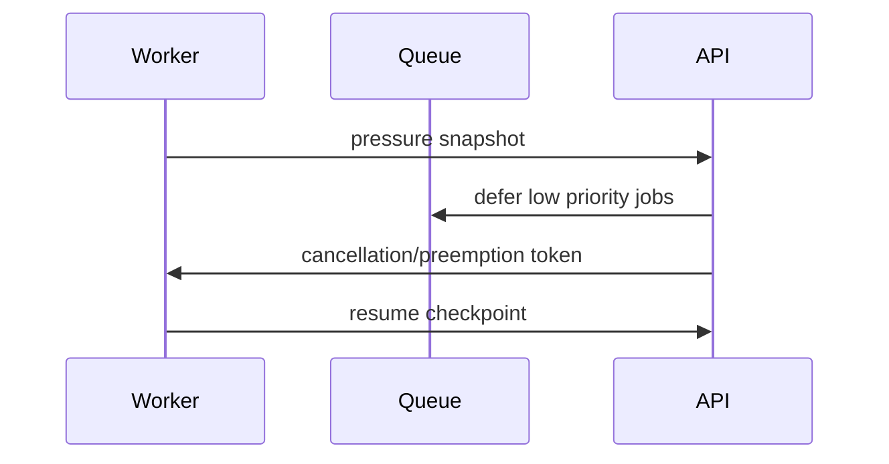

# Stability Event Flows

## Ontology And Confidence

```mermaid
sequenceDiagram
  participant Worker
  participant API
  participant Ontology
  participant Memory
  Worker->>API: interpretive packet with label ids
  API->>Ontology: validate labels
  API->>API: derive confidence aggregation
  API->>Memory: create memory candidate
  Memory->>Memory: validate, score, decay
```

## Feedback And Consensus

```mermaid
sequenceDiagram
  participant User
  participant API
  participant Consensus
  participant Memory
  User->>API: feedback/correction
  API->>Consensus: update agreement/disagreement
  Consensus->>Memory: adjust weighting through gateway
```

## Resource Pressure And Preemption

```mermaid
sequenceDiagram
  participant Worker
  participant Queue
  participant API
  Worker->>API: pressure snapshot
  API->>Queue: defer low priority jobs
  API->>Worker: cancellation/preemption token
  Worker->>API: resume checkpoint
```
