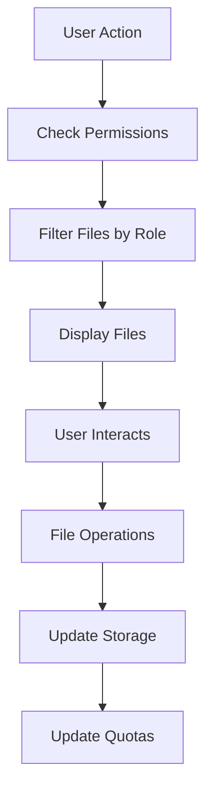
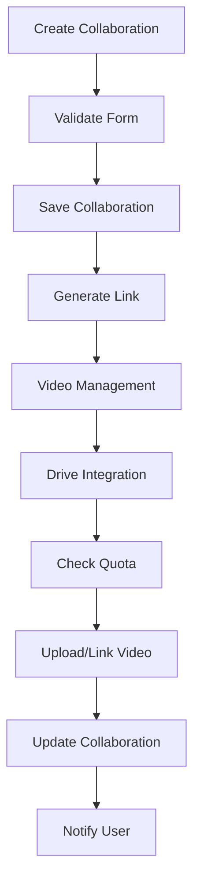
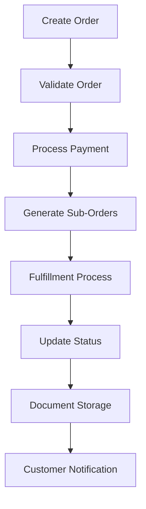
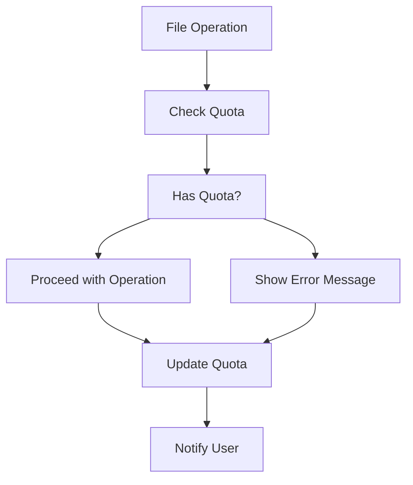

# Digital HQ - Project Logic Documentation

## 📋 Table of Contents

1. [Collaboration System](#collaboration-system)
2. [Drive System](#drive-system)
3. [Orders & Sub-Orders](#orders--sub-orders)
4. [User Management & Hierarchy](#user-management--hierarchy)
5. [File Storage & Quotas](#file-storage--quotas)
6. [Video Processing](#video-processing)
7. [Data Flow](#data-flow)
8. [API Integration Points](#api-integration-points)

---

## 🔗 Collaboration System

### Core Components

#### Collaboration.vue
**Purpose**: Manage video collaborations between creators and brands

**Key Features**:
- Filter tabs (On Going, Halted, End, Declined)
- Create/Edit collaboration forms
- Video management with dynamic sections
- Platform support (TikTok, Instagram, YouTube)
- Payment tracking (Paid, Product, Paid Product)

### Data Structure

```javascript
// Collaboration Form Structure
const collaborationForm = {
  name: String (required),
  channel: String (required),
  platform: Array<String> (required),
  collaboratorEmail: String (optional),
  type: String (required) // 'Paid', 'Product', 'Paid Product'
  price: Number (required),
  numVideos: Number (required),
  videos: Array<{
    script: String,
    title: String,
    subtitles: String,
    caption: String,
    hashtags: String,
    draftFile: File,
    draftLink: String,
    invitation: Boolean,
    postLinks: Object,
    paid: Boolean,
    done: Boolean
  }>
}
```

### Collaboration Lifecycle

1. **Creation Phase**
   - Form validation with required fields
   - Dynamic video sections based on `numVideos`
   - Generate collaboration link after save

2. **Management Phase**
   - Edit video details (script, title, etc.)
   - Status management (Halt, Decline, Done)
   - Video draft management with Drive integration

3. **Completion Phase**
   - Mark videos as "Done"
   - Track completion progress
   - Generate final reports

### Video Draft Management

```javascript
const handleVideoUpload = async (event, videoIndex) => {
  const file = event.target.files[0]
  if (file) {
    // Check quota before upload
    if (!hasQuotaForUpload(file.size)) {
      showError('Insufficient quota. Please delete files or contact Operator.')
      return
    }
    
    // Store in Drive with proper path structure
    const path = `/storage/${userId}/collaborations/${collaborationForm.name.toLowerCase().replace(/\s+/g, '-')}/${file.name}`
    
    // Update used quota
    usedQuota.value += file.size
    
    // Store file reference
    collaborationForm.videos[videoIndex].draftFile = file
    collaborationForm.videos[videoIndex].draftLink = ''
    
    // In real app: upload to storage service
    await uploadToStorage(file, path)
  }
}

const hasQuotaForUpload = (fileSize = 0) => {
  return (usedQuota.value + fileSize) <= userQuota.value
}
```

---

## 💾 Drive System

### Core Components

#### Drive.vue
**Purpose**: File storage system with user hierarchy and sharing capabilities

### User Hierarchy Implementation

```javascript
// User Roles and Permissions
const userRoles = {
  OP: 'Operator',    // Can see all files
  AD: 'Admin',       // Can see all USER files + shared OP files
  USER: 'User'        // Can see own files + shared AD files
}

// Access Control Logic
const filterFilesByRole = (files, userRole) => {
  switch (userRole) {
    case 'USER':
      return files.filter(file => 
        file.ownerRole === 'USER' || 
        (file.ownerRole === 'AD' && file.accessLevel === 'account') ||
        (file.ownerRole === 'AD' && file.accessLevel === 'link')
      )
    case 'AD':
      return files.filter(file => 
        file.ownerRole === 'AD' || 
        file.ownerRole === 'USER' ||
        (file.ownerRole === 'OP' && file.accessLevel === 'account') ||
        (file.ownerRole === 'OP' && file.accessLevel === 'link')
      )
    case 'OP':
      return files // OP can see all files
    default:
      return []
  }
}
```

### File Sharing System

```javascript
// Share Configuration
const shareConfig = {
  private: 'only me',
  account: 'anyone with account',
  link: 'anyone with link'
}

// Link Generation
const generateShareLink = (file, encrypted, shortLink) => {
  const baseUrl = window.location.origin
  const fileId = file.id
  
  if (shortLink) {
    return `${baseUrl}/s/${fileId}`
  }
  
  if (encrypted) {
    // Generate encrypted link
    return `${baseUrl}/share/encrypted/${fileId}`
  }
  
  return `${baseUrl}/share/${fileId}`
}
```

### File Operations

```javascript
// File Management Operations
const fileOperations = {
  upload: (file, path) => {
    // Upload file to storage
    // Update quotas
    // Apply hierarchy permissions
  },
  delete: (fileId) => {
    // Delete file from storage
    // Update quotas
    // Check permissions
  },
  share: (fileId, accessLevel, encrypted, shortLink) => {
    // Update file sharing settings
    // Generate share link
    // Send notifications
  },
  rename: (fileId, newName) => {
    // Update file metadata
    // Update Drive references
  }
}
```

---

## 📦 Orders & Sub-Orders

### Order Management

#### OrdersCreate.vue
**Purpose**: Create new orders and manage order details

#### Order Structure
```javascript
const orderStructure = {
  id: String,
  customer: {
    name: String,
    email: String,
    phone: String,
    address: Object
  },
  items: Array<{
    id: String,
    product: String,
    quantity: Number,
    price: Number,
    status: String
  }>,
  status: 'pending' | 'confirmed' | 'processing' | 'shipped' | 'delivered' | 'cancelled',
  total: Number,
  createdAt: String,
  updatedAt: String
}
```

#### Sub-Order Management

```javascript
const subOrderStructure = {
  id: String,
  orderId: String,
  items: Array<{
    id: String,
    product: String,
    quantity: Number,
    price: Number,
    status: String,
    tracking: Object
  }>,
  status: 'pending' | 'processing' | 'completed' | 'cancelled',
  createdAt: String,
  updatedAt: String
}
```

### Order Processing Flow

1. **Order Creation**
   - Customer information collection
   - Product selection and quantity
   - Price calculation
   - Order confirmation

2. **Order Processing**
   - Inventory verification
   - Payment processing
   - Sub-order generation

3. **Fulfillment**
   - Sub-order assignment
   - Tracking updates
   - Delivery confirmation

### Integration Points

```javascript
// Order API Endpoints
const orderEndpoints = {
  createOrder: '/api/orders',
  getOrder: '/api/orders/:id',
  updateOrder: '/api/orders/:id',
  deleteOrder: '/api/orders/:id',
  getSubOrders: '/api/orders/:id/suborders'
}

// Drive Integration for Order Documents
const orderDocuments = {
  uploadInvoice: (orderId, file) => {
    // Store invoice in Drive
    const path = `/storage/${userId}/orders/${orderId}/invoices/${file.name}`
    return uploadToDrive(file, path)
  },
  uploadContract: (orderId, file) => {
    // Store contract in Drive
    const path = `/storage/${userId}/orders/${orderId}/contracts/${file.name}`
    return uploadToDrive(file, path)
  }
}
```

---

## 👥 User Management & Hierarchy

### Role-Based Access Control

```javascript
// User Role Definitions
const userRoles = {
  OP: {
    permissions: [
      'view_all_files',
      'manage_users',
      'manage_system',
      'view_analytics',
      'manage_billing'
    ]
  },
  AD: {
    permissions: [
      'view_all_user_files',
      'manage_user_files',
      'view_analytics',
      'manage_collaborations'
    ]
  },
  USER: {
    permissions: [
      'view_own_files',
      'manage_own_files',
      'create_collaborations',
      'upload_videos'
    ]
  }
}
```

### Permission Checking

```javascript
const hasPermission = (permission, userRole) => {
  return userRoles[userRole]?.permissions.includes(permission)
}

const canAccessFile = (file, userRole, fileOwnerRole) => {
  switch (userRole) {
    case 'OP':
      return true // OP can access everything
    case 'AD':
      return fileOwnerRole === 'USER' || 
             fileOwnerRole === 'AD' ||
             (fileOwnerRole === 'OP' && file.accessLevel !== 'private')
    case 'USER':
      return fileOwnerRole === 'USER' ||
             (fileOwnerRole === 'AD' && file.accessLevel === 'account')
    default:
      return false
  }
}
```

### User Data Structure

```javascript
const userStructure = {
  id: String,
  role: 'OP' | 'AD' | 'USER',
  email: String,
  name: String,
  quota: Number,
  usedQuota: Number,
  createdAt: String,
  permissions: Array<String>,
  profile: {
    company: String,
    department: String,
    manager: String
  }
}
```

---

## 📁 File Storage & Quotas

### Quota Management System

```javascript
// Quota Tiers by User Role
const quotaTiers = {
  OP: 50000000000,    // 50GB
  AD: 10000000000,    // 10GB
  USER: 5000000000     // 5GB
}

// Quota Enforcement
const enforceQuota = (fileSize, userQuota, usedQuota) => {
  if ((usedQuota + fileSize) > userQuota) {
    throw new Error('Insufficient quota')
  }
  return true
}

// Quota Tracking
const updateQuota = (fileSize, isUpload = true) => {
  if (isUpload) {
    usedQuota += fileSize
  } else {
    usedQuota -= fileSize
  }
}
```

### Storage Path Structure

```javascript
// Directory Structure
const storagePaths = {
  userFiles: `/storage/${userId}/files/`,
  collaborations: `/storage/${userId}/collaborations/`,
  orders: `/storage/${userId}/orders/`,
  temp: `/storage/${userId}/temp/`
}

// Collaboration Video Storage
const getCollaborationVideoPath = (collaborationName, videoIndex) => {
  const safeName = collaborationName.toLowerCase().replace(/[^a-z0-9]/g, '-')
  return `${storagePaths.collaborations}/${safeName}/video_${videoIndex}`
}

// Order Document Storage
const getOrderPath = (orderId, documentType) => {
  return `${storagePaths.orders}/${orderId}/${documentType}`
}
```

---

## 🎥 Video Processing

### Video Upload Workflow

```javascript
const videoUploadProcess = async (file, collaborationName, videoIndex) => {
  try {
    // 1. Validate quota
    if (!hasQuotaForUpload(file.size)) {
      throw new Error('Insufficient quota')
    }
    
    // 2. Generate storage path
    const path = getCollaborationVideoPath(collaborationName, videoIndex)
    
    // 3. Upload file to storage
    const result = await uploadToStorage(file, path)
    
    // 4. Generate thumbnail (if video)
    if (file.type.startsWith('video/')) {
      const thumbnailPath = `${path}/thumbnail.jpg`
      await generateThumbnail(file, thumbnailPath)
    }
    
    // 5. Update quotas
    updateQuota(file.size, true)
    
    return {
      filePath: path,
      thumbnailPath: thumbnailPath,
      fileSize: file.size
    }
  } catch (error) {
    console.error('Video upload failed:', error)
    throw error
  }
}
```

### Thumbnail Generation

```javascript
const generateThumbnail = async (videoFile, outputPath) => {
  // In a real app, this would use FFmpeg
  const ffmpegCommand = `ffmpeg -i "${videoFile.path}" -ss 00:00:01 "${outputPath}"`
  
  try {
    await executeCommand(ffmpegCommand)
    return outputPath
  } catch (error) {
    console.error('Thumbnail generation failed:', error)
    throw error
  }
}
```

### Video Metadata Management

```javascript
const videoMetadata = {
  duration: Number,
  format: String,
  resolution: String,
  size: Number,
  thumbnail: String,
  uploadedAt: String,
  processedAt: String
}

const extractVideoMetadata = async (videoFile) => {
  const metadata = await getVideoMetadata(videoFile)
  return {
    duration: metadata.duration,
    format: metadata.format,
    resolution: metadata.resolution,
    size: metadata.size
  }
}
```

---

## 🔄 Data Flow

### Drive Data Flow



### Collaboration Data Flow



### Order Data Flow



### Quota Data Flow



---

## 🔗 API Integration Points

### Drive API Endpoints

```javascript
// File Management
const driveAPI = {
  // File Operations
  uploadFile: '/api/drive/upload',
  deleteFile: '/api/drive/files/:id',
  renameFile: '/api/drive/files/:id/rename',
  moveFile: '/api/drive/files/:id/move',
  copyFile: '/api/drive/files/:id/copy',
  getFileInfo: '/api/drive/files/:id',
  
  // Sharing
  shareFile: '/api/drive/files/:id/share',
  updateShareSettings: '/api/drive/files/:id/share',
  generateLink: '/api/drive/files/:id/link',
  revokeLink: '/api/drive/files/:id/revoke',
  
  // Quota Management
  getQuota: '/api/users/:id/quota',
  updateQuota: '/api/users/:id/quota',
  getQuotaUsage: '/api/users/:id/quota/usage',
  
  // Hierarchy Management
  getUserFiles: '/api/users/:id/files',
  getAccessibleFiles: '/api/users/:id/files/accessible'
}
```

### Collaboration API Endpoints

```javascript
const collaborationAPI = {
  // Collaboration Management
  createCollaboration: '/api/collaborations',
  getCollaborations: '/api/collaborations',
  getCollaboration: '/api/collaborations/:id',
  updateCollaboration: '/api/collaborations/:id',
  deleteCollaboration: '/api/collaborations/:id',
  
  // Video Management
  uploadVideo: '/api/collaborations/:id/videos/:index/upload',
  getVideo: '/api/collaborations/:id/videos/:index',
  updateVideo: '/api/collaborations/:id/videos/:index',
  deleteVideo: '/api/collaborations/:id/videos/:index',
  
  // Status Management
  haltCollaboration: '/api/caborations/:id/halt',
  declineCollaboration: '/api/collaborations/:id/decline',
  markDone: '/api/collaborations/:id/done',
  getCollaborationStatus: '/api/collaborations/:id/status'
}
```

### Order API Endpoints

```javascript
const orderAPI = {
  // Order Management
  createOrder: '/api/orders',
  getOrders: '/api/orders',
  getOrder: '/api/orders/:id',
  updateOrder: '/api/orders/:id',
  deleteOrder: '/api/orders/:id',
  
  // Sub-Order Management
  getSubOrders: '/api/orders/:id/suborders',
  createSubOrder: '/api/orders/:id/suborders',
  updateSubOrder: '/api/orders/:id/suborders/:subId',
  deleteSubOrder: '/api/orders/:id/suborders/:subId',
  
  // Document Management
  uploadInvoice: '/api/orders/:id/invoices',
  uploadContract: '/api/orders/:id/contracts',
  getDocuments: '/api/orders/:id/documents'
}
```

### User Management API Endpoints

```javascript
const userAPI = {
  // User Management
  getUser: '/api/users/:id',
  updateUser: '/api/users/:id',
  getUsersByRole: '/api/users/role/:role',
  updateUserRole: '/api/users/:id/role',
  
  // Quota Management
  getUserQuota: '/api/users/:id/quota',
  updateUserQuota: '/api/users/:id/quota',
  resetUserQuota: '/api/users/:id/quota/reset'
}
```

---

## 🛡️ Error Handling

### Quota Management Errors

```javascript
const quotaErrors = {
  INSUFFICIENT_QUOTA: 'Insufficient storage quota. Please delete files or contact your Operator.',
  UPLOAD_FAILED: 'File upload failed. Please try again.',
  DELETE_FAILED: 'File deletion failed. Please try again.',
  QUOTA_EXCEEDED: 'Storage quota exceeded. Please manage your files.'
}
```

### File Permission Errors

```javascript
const permissionErrors = {
  ACCESS_DENIED: 'You don\'t have permission to access this file.',
  DELETE_DENIED: 'You don\'t have permission to delete this file.',
  SHARE_DENIED: 'You don\'t have permission to share this file.',
  RENAME_DENIED: 'You don\'t have permission to rename this file.'
}
```

### Collaboration Errors

```javascript
const collaborationErrors = {
  INVALID_PRICE: 'Price cannot be negative.',
  INVALID_VIDEO_COUNT: 'Number of videos must be at least 1.',
  PLATFORM_REQUIRED: 'At least one platform must be selected.',
  VIDEO_UPLOAD_FAILED: 'Video upload failed. Please try again.',
  COLLABORATION_NOT_FOUND: 'Collaboration not found.',
  PERMISSION_DENIED: 'You don\'t have permission to edit this collaboration.'
}
```

---

## 🎯 Frontend State Management

### Reactive State Management

```javascript
// Drive State
const driveState = {
  files: ref([]),
  selectedFiles: ref([]),
  currentPath: ref(''),
  userRole: ref('USER'),
  userQuota: ref(5000000000),
  usedQuota: ref(0),
  shareSettings: ref({})
}

// Collaboration State
const collaborationState = {
  collaborations: ref([]),
  activeFilter: ref('On Going'),
  currentCollaboration: ref(null),
  isEditing: ref(false),
  collaborationForm: reactive({...})
}
```

### State Persistence

```javascript
// Local Storage for User Preferences
const saveUserPreferences = (preferences) => {
  localStorage.setItem('userPreferences', JSON.stringify(preferences))
}

const loadUserPreferences = () => {
  const saved = localStorage.getItem('userPreferences')
  return saved ? JSON.parse(saved) : {}
}

// Session Storage for Temporary Data
const saveSessionData = (key, data) => {
  sessionStorage.setItem(key, JSON.stringify(data))
}

const getSessionData = (key) => {
  const saved = sessionStorage.getItem(key)
  return saved ? JSON.parse(saved) : null
}
```

---

## 🔧 Configuration

### Environment Variables

```javascript
const config = {
  // Storage Configuration
  storage: {
    provider: 's3', // 's3', 'gcs', 'local'
  },
  
  // Quota Configuration
  quotas: {
    OP: 50000000000,    // 50GB
    AD: 10000000000,    // 10GB
    USER: 5000000000     // 5GB
  },
  
  // File Size Limits
  maxFileSize: 1000000000, // 1GB per file
  maxVideosPerCollaboration: 10,
  
  // Video Configuration
  supportedFormats: ['mp4', 'mov', 'avi', 'webm'],
  thumbnailQuality: 'medium',
  thumbnailTime: '00:00:01'
}
```

### Feature Flags

```javascript
const features = {
  dragAndDrop: true,
  rightClick: true,
  dragSelection: true,
  encryptedLinks: true,
  shortLinks: true,
  videoThumbnails: true,
  quotaEnforcement: true,
  hierarchyEnforcement: true
}
```

---

## 📊 Monitoring & Analytics

### Usage Analytics

```javascript
const analytics = {
  trackFileOperations: (operation, fileType, userRole) => {
    // Log file operations for analytics
  },
  trackCollaborationMetrics: (collaborationId) => {
    // Track collaboration performance metrics
  },
  trackQuotaUsage: (userId) => {
    // Monitor quota usage patterns
  }
}
```

### Performance Metrics

```javascript
const performanceMetrics = {
  uploadSpeed: 'average_upload_speed',
  storageEfficiency: 'storage_efficiency',
  errorRate: 'error_rate',
  userSatisfaction: 'user_satisfaction'
}
```

---

## 🚀 Security Considerations

### Data Protection

```javascript
// Data Encryption
const encryptionConfig = {
  algorithm: 'AES-256-GCM',
  keyManagement: 'cloud-kms',
  encryptionAtRest: true,
  encryptionInTransit: true
}

// Access Control
const accessControl = {
  rbac: true,
  abac: true,
  encryption: true,
  auditLogging: true
}
```

### File Security

```javascript
const fileSecurity = {
  virusScanning: true,
  malwareDetection: true,
  contentValidation: true,
  accessLogging: true
}
```

---

## 🔄 Future Enhancements

### Planned Features

1. **Real-time Collaboration**
   - Live video streaming
   - Real-time editing capabilities
   - Multi-user collaboration

2. **Advanced Analytics**
   - Detailed usage analytics
   - Performance metrics
   - User behavior tracking

3. **Enhanced Security**
   - End-to-end encryption
   - Advanced access controls
   - Audit trail improvements

4. **Mobile Applications**
   - Native mobile apps for Drive
   - Push notifications
   - Offline capabilities

5. **API Improvements**
   - GraphQL API
  - WebSocket real-time updates
  - Batch operations

---

## 📝 Implementation Status

### ✅ Completed Features

- [x] User hierarchy system (OP > AD > USER)
- [x] File sharing with encrypted/short links
- [x] Drag and drop file upload
- [x] Drag selection for multiple files
- [x] Quota management system
- [x] Collaboration creation and management
- [x] Video draft upload with Drive integration
- [x] Platform-specific post links
- [x] Payment tracking
- [x] Status management (Halt, Decline, Done)
- [x] Video thumbnail generation
- [x] Right-click context menus
- [x] Grid and list views

### 🚧 In Progress

- [ ] Real-time collaboration features
- [ ] Advanced analytics dashboard
- [ ] Mobile applications
- [ ] Enhanced security features
- [ ] API integration
- [ ] Performance optimizations

---

## 📞 Support & Maintenance

### Common Issues

1. **Quota Exceeded**
   - Delete unnecessary files
   - Contact Operator for quota increase
   - Upgrade to higher tier plan

2. **Upload Failures**
   - Check file format compatibility
   - Verify internet connection
   - Check available storage space

3. **Permission Denied**
   - Verify user role
   - Check file ownership
   - Contact administrator

4. **Video Processing**
   - Ensure video format support
   - Check thumbnail generation
   - Verify storage paths

### Getting Help

- **Documentation**: `/docs/drive` and `/docs/collaboration`
- **Support**: Contact support team
- **Community**: Join our community forums
- **Training**: Access video tutorials

---

*Last Updated: March 1, 2026*
*Version: 1.0.0*
